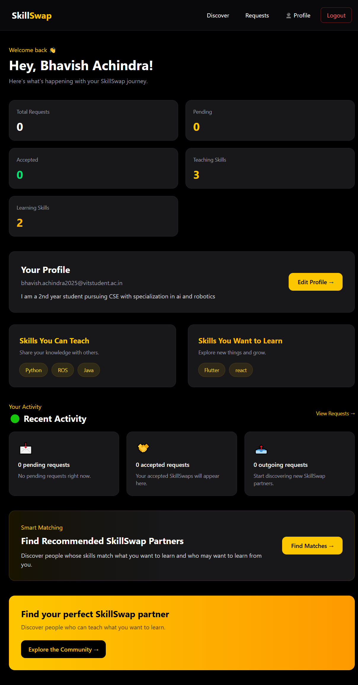
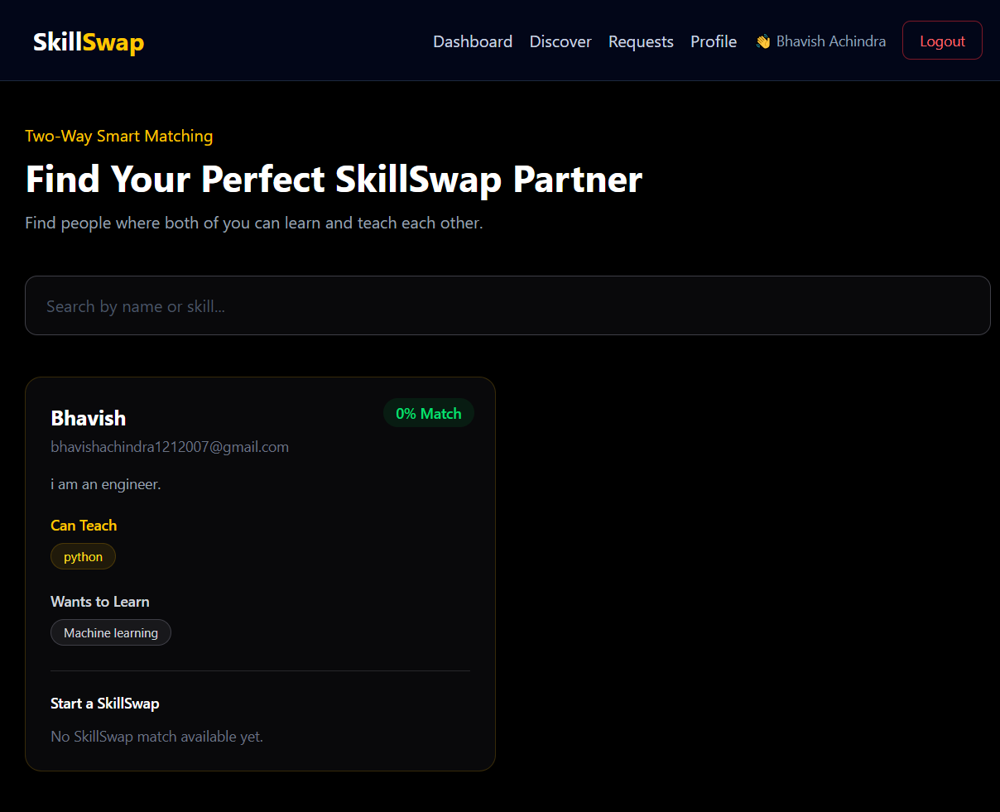
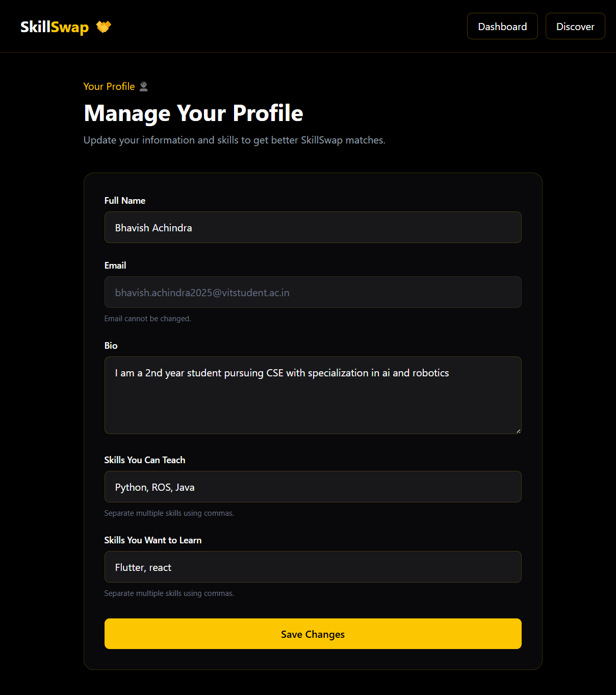
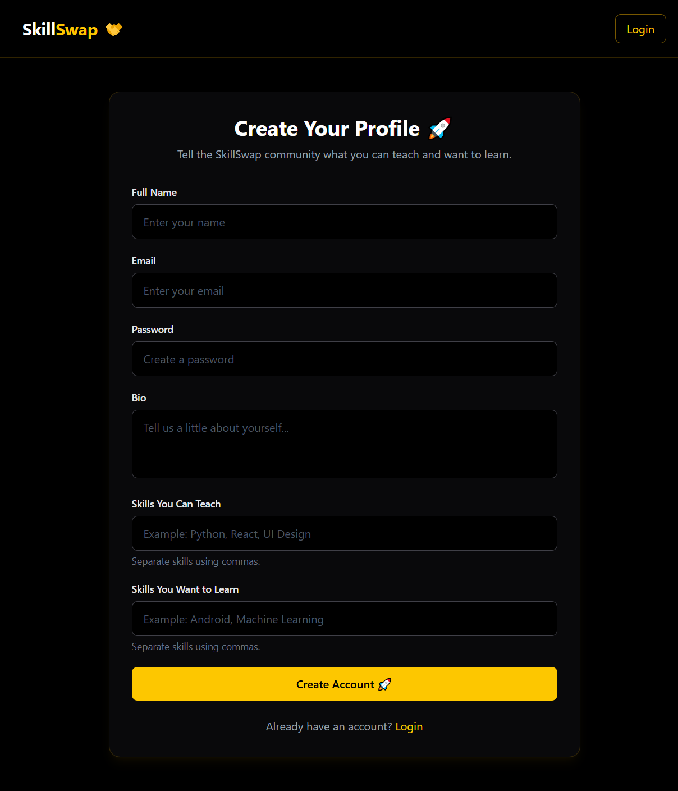
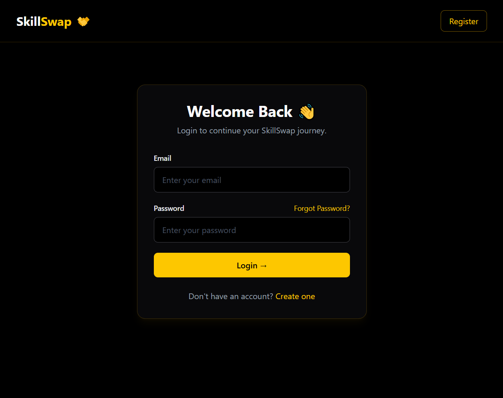

# SkillSwap

SkillSwap is a full-stack web application that allows students and learners to connect with each other based on the skills they can teach and the skills they want to learn.

Instead of searching randomly for people to learn from, SkillSwap helps users discover relevant skill matches and send skill-swap requests directly through the platform.

---

##  Features:

###  Authentication
- User registration
- User login
- JWT-based authentication
- Forgot password functionality
- Password reset functionality

###  User Profiles
- Create and manage a personal profile
- Add skills you can teach
- Add skills you want to learn
- Update profile information

###  Discover Skills
- Browse other users
- Search users by name or skills
- View skills that users can teach
- View skills that users want to learn
- Identify compatible skill matches

###  Skill Matching
SkillSwap compares the skills a user wants to learn with the skills another user can teach.

It also checks the reverse relationship:

- What they can teach you
- What you can teach them

This helps users find meaningful skill-swap opportunities.

###  Swap Requests
- Send skill-swap requests
- Include a custom message
- View incoming requests
- Accept requests
- Reject requests
- Track request status

---

##  Tech Stack

### Frontend
- React
- TypeScript
- Vite
- React Router
- Tailwind CSS

### Backend
- Node.js
- Express.js
- JavaScript
- JWT
- bcryptjs

### Database
- MongoDB
- Mongoose
- MongoDB Atlas

---

##  Setup & Installation

### Prerequisites

Before running SkillSwap, make sure the following are installed:

- Node.js
- npm
- Git
- MongoDB Atlas account

1. Clone the Repository

Clone the GitHub repository and open the project folder:

git clone https://github.com/Baves007/SkillSwap.git
cd SkillSwap

2. Install Backend Dependencies

Navigate to the server folder:

cd server
npm install

Create a .env file inside the server folder and add your MongoDB connection string and JWT secret.

Example:

MONGO_URI=your_mongodb_connection_string
JWT_SECRET=your_jwt_secret

## 3. Run the Backend

Start the backend server using:

npm run dev

The backend server runs on particular localhost.

## 4. Install Frontend Dependencies

Open a new terminal and navigate to the client folder:

cd SkillSwap/client
npm install

## 5. Run the Frontend

Start the React development server:

npm run dev

Vite will display a local URL in the terminal. Open that URL in your browser. Usually something like https://localhost:5***/

▶ HOW TO USE :

1. Open the SkillSwap application in your browser.
2. Register a new account.
3. Log in using your credentials.
4. Complete your profile.
5. Add the skills you can teach.
6. Add the skills you want to learn.
7. Go to the Discover page to find other users.
8. View compatible skill matches.
9. Send a Skill Swap Request with a message.
10. Go to the Requests page to view incoming requests.
11. Accept or reject skill-swap requests.
12. Use the Matches page to find suitable learning partners.
13. Update your skills and profile information from the Profile page.

## 📸 Screenshots

### Dashboard

### Discover

### Profile

### Register

### Login

## 🎥Demo Video

[▶ Watch the SkillSwap Demo](https://www.loom.com/share/b0004001ba3c43d886804bf2dff0a3d1)

##  Author
Developed as a full-stack web development project.

**GitHub:**  
https://github.com/Baves007/SkillSwap
